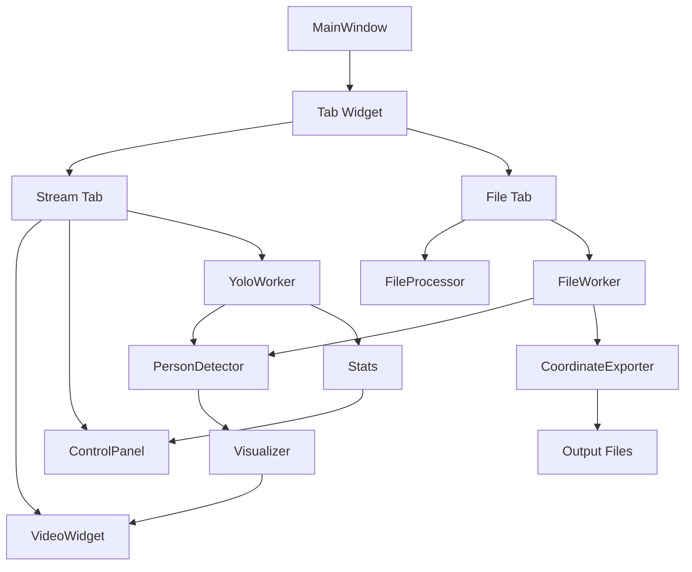

# GUI Module Documentation v2.1.0

## Overview
PySide6-based GUI application for YOLOv11 person detection system. Features a tab interface for dual-mode operation (Stream/File) with automatic resource management.

## Architecture

```
src/gui/
│
├── windows/              # Window management
│   └── main_window.py   # Main application window with tab interface
│
├── widgets/              # UI components
│   ├── video_display.py # Stream video display widget
│   ├── control_panel.py # Stream control panel
│   └── file_processor.py # File processing widget
│
└── workers/              # Background processing threads
    ├── base_worker.py   # Base class for workers
    ├── yolo_worker.py   # Stream detection worker
    └── file_worker.py   # File processing worker
```

## Component Details

### 🪟 windows/main_window.py
**Class**: `MainWindow(QMainWindow)`
- **Purpose**: Main application window with tab interface
- **Key Features**:
  - Tab widget for Stream/File mode switching
  - Automatic resource management on tab change
  - Menu bar with File/View/Help menus
  - Status bar for real-time feedback

**Important Methods**:
```python
setup_ui()                    # Initialize UI layout
setup_stream_tab()            # Configure Stream tab
on_tab_changed(index)         # Handle tab switching
on_file_processing_started()  # Start file processing
```

**Tab Management**:
- Automatically pauses Stream when switching to File tab
- Resumes Stream when returning if it was previously running
- Prevents resource conflicts between modes

### 📺 widgets/video_display.py
**Classes**: 
- `ScaledLabel(QLabel)` - Custom label with aspect ratio preservation
- `VideoWidget(QWidget)` - Main video display widget

**Key Features**:
- Maintains aspect ratio during window resize
- Prevents resize event loops with custom paintEvent
- Frame rate limiting (30 FPS)
- Error message display

**Signals**:
- `double_clicked`: Emitted for fullscreen toggle

**Methods**:
```python
update_frame(qimage)     # Update displayed frame
show_message(text)       # Display text message
show_error(error)        # Display error message
```

### 🎛️ widgets/control_panel.py
**Class**: `ControlPanel(QWidget)`
- **Purpose**: Stream mode control interface
- **Sections**:
  - Main Controls (Play/Pause, Screenshot, Reset)
  - Detection Settings (Model, Confidence)
  - Camera Settings (Index, Resolution, FPS)
  - Statistics Display (Real-time metrics)

**Signals**:
```python
play_pause_clicked          # Toggle detection
screenshot_clicked          # Capture screenshot
confidence_changed(float)   # Adjust threshold
model_changed(str)         # Change model
camera_settings_changed(dict) # Update camera
```

**State Management**:
```python
set_play_state(bool)       # External state control
update_statistics(dict)    # Update metrics display
```

### 📁 widgets/file_processor.py
**Class**: `FileProcessorWidget(QWidget)`
- **Purpose**: Video file processing interface
- **Features**:
  - File selection with drag & drop
  - Processing options configuration
  - Output format selection
  - Progress tracking
  - Results table display

**Signals**:
```python
process_started(dict)      # Begin processing
process_stopped()          # Stop processing
file_selected(str)         # File chosen
```

**Key Methods**:
```python
set_input_file(path)       # Load video file
get_processing_params()    # Get configuration
update_progress(...)       # Update progress bar
add_result_row(...)        # Add detection result
```

### 🔧 workers/base_worker.py
**Class**: `BaseDetectionWorker(QThread)`
- **Purpose**: Base class for detection workers
- **Common Features**:
  - OpenCV to QImage conversion
  - Detection data formatting
  - Error handling
  - Resource cleanup

**Shared Methods**:
```python
convert_cv_to_qimage(cv_img)    # Image conversion
format_detection_data(detection) # Data formatting
handle_error(message, exception) # Error handling
stop()                           # Thread termination
```

### 🎥 workers/yolo_worker.py
**Class**: `YoloDetectionWorker(BaseDetectionWorker)`
- **Purpose**: Stream mode detection processing
- **Features**:
  - Real-time webcam processing
  - Frame-by-frame detection
  - Performance monitoring
  - Pause/resume support

**Signals**:
```python
frame_ready(QImage)        # Processed frame
stats_updated(dict)        # Performance metrics
error_occurred(str)        # Error notification
```

**Control Methods**:
```python
pause()                    # Pause detection
resume()                   # Resume detection
update_confidence_threshold(float)
update_model(str)
capture_screenshot()
```

### 📹 workers/file_worker.py
**Class**: `FileProcessingWorker(BaseDetectionWorker)`
- **Purpose**: Video file processing
- **Features**:
  - Batch video processing
  - Frame skipping support
  - Multiple export formats
  - Progress reporting

**Signals**:
```python
progress_updated(int, int, float, float)  # Progress info
frame_processed(int, float, list)         # Frame results
processing_completed(dict)                 # Completion
log_message(str)                          # Log output
```

**Processing Flow**:
1. Open video file
2. Initialize output writers
3. Process frames with optional skip
4. Export detection data
5. Cleanup resources

## Data Flow



## Signal/Slot Connections

### Stream Mode
```python
YoloWorker.frame_ready → VideoWidget.update_frame
YoloWorker.stats_updated → ControlPanel.update_statistics
ControlPanel.confidence_changed → YoloWorker.update_confidence
ControlPanel.model_changed → YoloWorker.update_model
```

### File Mode
```python
FileProcessor.process_started → FileWorker.start
FileWorker.progress_updated → FileProcessor.update_progress
FileWorker.processing_completed → FileProcessor.processing_completed
FileWorker.log_message → FileProcessor.log_message
```

### Tab Management
```python
TabWidget.currentChanged → MainWindow.on_tab_changed
→ Pause/Resume Stream detection
→ Stop File processing if active
```

## Performance Optimizations

### 1. Frame Rate Control
- VideoWidget limits updates to 30 FPS
- Prevents UI overload from high-speed cameras

### 2. Resource Management
- Automatic Stream pause when File tab active
- Single detection engine at a time
- Proper thread cleanup on exit

### 3. Memory Management
- Frame buffer size = 1 (minimal latency)
- QImage copies for thread safety
- Cleanup methods in all workers

### 4. Resize Optimization
- Custom paintEvent prevents resize loops
- Aspect ratio preserved without recalculation

## Configuration

### Stream Settings
```python
DEFAULT_CAMERA_INDEX = 0
DEFAULT_RESOLUTION = (1280, 720)
DEFAULT_FPS = 30
DEFAULT_MODEL = "yolo11n.pt"
DEFAULT_CONFIDENCE = 0.5
```

### File Processing Settings
```python
SUPPORTED_VIDEO_FORMATS = [".mp4", ".avi", ".mov", ...]
EXPORT_FORMATS = [".json", ".csv", ".xml"]
DEFAULT_FRAME_SKIP = 1  # Process every frame
```

## Error Handling

### Common Issues & Solutions

**Stream Mode**:
- Camera not found → Try indices 0-4 automatically
- Low FPS → Suggest lighter model
- Detection failure → Display error in VideoWidget

**File Mode**:
- Invalid file → Show warning dialog
- Processing error → Log and display in output
- Export failure → Retain detection data for retry

## Testing

### Unit Tests
```bash
python debug/test_gui.py         # Basic GUI test
python debug/test_gui_tabs.py    # Tab functionality
python debug/test_file_processing.py  # File processing
```

### Integration Tests
1. Launch GUI: `python gui_main.py`
2. Switch between tabs
3. Verify Stream pauses when File tab active
4. Process sample video in debug/sample_video/
5. Check output files in debug/output/

## Future Enhancements

### Planned Features
- [ ] Multi-camera support in Stream mode
- [ ] Batch file processing queue
- [ ] Real-time graph visualization
- [ ] Custom detection zones
- [ ] Recording capability in Stream mode
- [ ] Cloud storage integration

### Architecture Improvements
- [ ] Plugin system for custom processors
- [ ] Configurable UI layouts
- [ ] Theme customization
- [ ] Internationalization support

## Maintenance Guide

### Adding New Features

1. **New Widget**:
   - Create in `widgets/` directory
   - Inherit from appropriate Qt class
   - Define signals for communication
   - Integrate in main_window.py

2. **New Worker**:
   - Inherit from BaseDetectionWorker
   - Implement run() method
   - Define specific signals
   - Handle cleanup properly

3. **New Tab**:
   - Create widget for tab content
   - Add to MainWindow.tab_widget
   - Implement resource management
   - Update on_tab_changed()

### Code Style
- PEP 8 compliance
- Type hints recommended
- Docstrings for public methods
- Comments for complex logic

### Performance Monitoring
```python
# Use built-in performance monitor
from src.utils.performance import PerformanceMonitor

monitor = PerformanceMonitor()
monitor.start_frame()
# ... processing ...
monitor.end_frame(detection_count)
stats = monitor.get_stats()
```

## Dependencies

- **PySide6** >= 6.6.0 - GUI framework
- **OpenCV** >= 4.8.0 - Image processing
- **NumPy** >= 1.24.0 - Array operations
- **Ultralytics** >= 8.2.0 - YOLOv11 models

## Version History

### v2.1.0 (2025-08-17)
- Added tab interface
- Implemented File processing mode
- Automatic resource management
- Base worker class
- Bug fixes for resize and encoding

### v2.0.0 (2025-08-17)
- Initial GUI implementation
- Stream mode only
- Basic controls

---
**Last Updated**: August 17, 2025  
**Version**: 2.1.0 "Dual Vision"