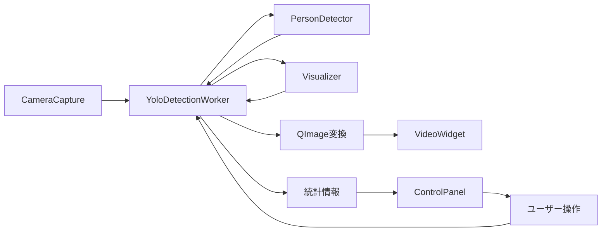

# GUI モジュール構造

## 概要
PySide6を使用したGUIアプリケーションのモジュール群です。MVCパターンに基づいて構造化されています。

## ディレクトリ構造

```
src/gui/
│
├── windows/              # ウィンドウ関連
│   └── main_window.py   # メインウィンドウクラス
│
├── widgets/              # UIウィジェット
│   ├── video_display.py # 映像表示ウィジェット
│   └── control_panel.py # コントロールパネル
│
└── workers/              # バックグラウンドワーカー
    └── yolo_worker.py   # YOLO検出処理スレッド
```

## 各モジュールの詳細

### windows/main_window.py
**クラス**: `MainWindow`
- **責務**: アプリケーションのメインウィンドウ管理
- **主な機能**:
  - UIレイアウトの構築
  - メニューバーの設定
  - 各ウィジェットの統合
  - イベントハンドリング

**重要なメソッド**:
```python
setup_ui()           # UI初期化
setup_menu()         # メニューバー構築
setup_connections()  # シグナル/スロット接続
setup_detection_worker() # 検出ワーカー初期化
```

### widgets/video_display.py
**クラス**: `VideoWidget`
- **責務**: リアルタイム映像の表示
- **主な機能**:
  - OpenCV画像からQImageへの変換
  - アスペクト比を保持したスケーリング
  - エラーメッセージ表示

**シグナル**:
- `double_clicked`: ダブルクリック時（フルスクリーン切替用）

**重要なメソッド**:
```python
update_frame(qimage)    # フレーム更新
scale_image(qimage)     # 画像スケーリング
show_message(message)   # メッセージ表示
show_error(error)       # エラー表示
```

### widgets/control_panel.py
**クラス**: `ControlPanel`
- **責務**: 検出パラメータの制御UI
- **主な機能**:
  - 再生/一時停止制御
  - 信頼度閾値調整
  - モデル選択
  - カメラ設定
  - 統計情報表示

**シグナル**:
```python
play_pause_clicked      # 再生/一時停止
screenshot_clicked      # スクリーンショット
confidence_changed(float) # 信頼度変更
model_changed(str)      # モデル変更
center_display_toggled(bool) # 中心点表示切替
reset_stats_clicked     # 統計リセット
camera_settings_changed(dict) # カメラ設定変更
```

### workers/yolo_worker.py
**クラス**: `YoloDetectionWorker`
- **責務**: バックグラウンドでの検出処理
- **継承**: `QThread`
- **主な機能**:
  - YOLOv11による人物検出
  - カメラからのフレーム取得
  - パフォーマンス計測
  - スレッドセーフな処理

**シグナル**:
```python
frame_ready(QImage)     # 処理済みフレーム
stats_updated(dict)     # 統計情報更新
error_occurred(str)     # エラー通知
```

**重要なメソッド**:
```python
run()                   # スレッドメイン処理
pause()                 # 一時停止
resume()                # 再開
stop()                  # 停止
update_confidence_threshold(float) # 閾値更新
update_model(str)       # モデル更新
capture_screenshot()    # スクリーンショット取得
```

## データフロー



## メンテナンスガイド

### 新機能追加時の手順

1. **新しいウィジェットを追加する場合**:
   - `widgets/`ディレクトリに新しいファイルを作成
   - `QWidget`を継承したクラスを実装
   - 必要なシグナルを定義
   - `main_window.py`で統合

2. **新しい検出モデルを追加する場合**:
   - `control_panel.py`のモデル選択リストに追加
   - `yolo_worker.py`の`update_model()`メソッドを更新

3. **新しい統計情報を追加する場合**:
   - `yolo_worker.py`の`stats_updated`シグナルに追加
   - `control_panel.py`の統計表示部分を更新

### パフォーマンス最適化のポイント

1. **画像処理**:
   - `convert_cv_to_qimage()`での変換は最小限に
   - 不要な画像コピーを避ける

2. **スレッド処理**:
   - UIスレッドをブロックしない
   - 重い処理は必ずワーカースレッドで実行

3. **メモリ管理**:
   - 大きな画像データは適切に解放
   - スレッド終了時のクリーンアップを確実に

### デバッグのヒント

1. **ログレベルの設定**:
   ```python
   logging.basicConfig(level=logging.DEBUG)
   ```

2. **スレッドデバッグ**:
   - `yolo_worker.py`の各メソッドにログを追加
   - `QThread.isRunning()`でスレッド状態を確認

3. **パフォーマンス計測**:
   - `PerformanceMonitor`クラスの統計を活用
   - フレーム処理時間を監視

## 依存関係

- **PySide6** >= 6.6.0: GUIフレームワーク
- **OpenCV**: 画像処理
- **NumPy**: 配列操作
- **Ultralytics**: YOLOv11モデル

## トラブルシューティング

### よくある問題と解決方法

1. **「カメラが見つからない」エラー**:
   - カメラインデックスを変更（0→1→2...）
   - カメラの権限を確認

2. **フレームレートが低い**:
   - 軽量モデル（yolo11n.pt）を使用
   - 解像度を下げる

3. **メモリリークの疑い**:
   - スレッド終了処理を確認
   - `_cleanup()`メソッドが正しく呼ばれているか確認

## 今後の拡張計画

- [ ] 複数カメラの同時表示
- [ ] 録画機能の追加
- [ ] 検出結果のエクスポート機能
- [ ] カスタムテーマ対応
- [ ] 設定の保存/読み込み機能

## コントリビューション

新機能の追加や改善を行う際は、以下のガイドラインに従ってください：

1. **コーディング規約**:
   - PEP 8準拠
   - 型ヒント使用推奨
   - docstring必須

2. **テスト**:
   - `debug/test_gui.py`でテスト実行
   - 新機能には対応するテストを追加

3. **ドキュメント**:
   - このREADMEを最新状態に保つ
   - 重要な変更はCHANGELOGに記載

---
*最終更新: 2025年8月17日*